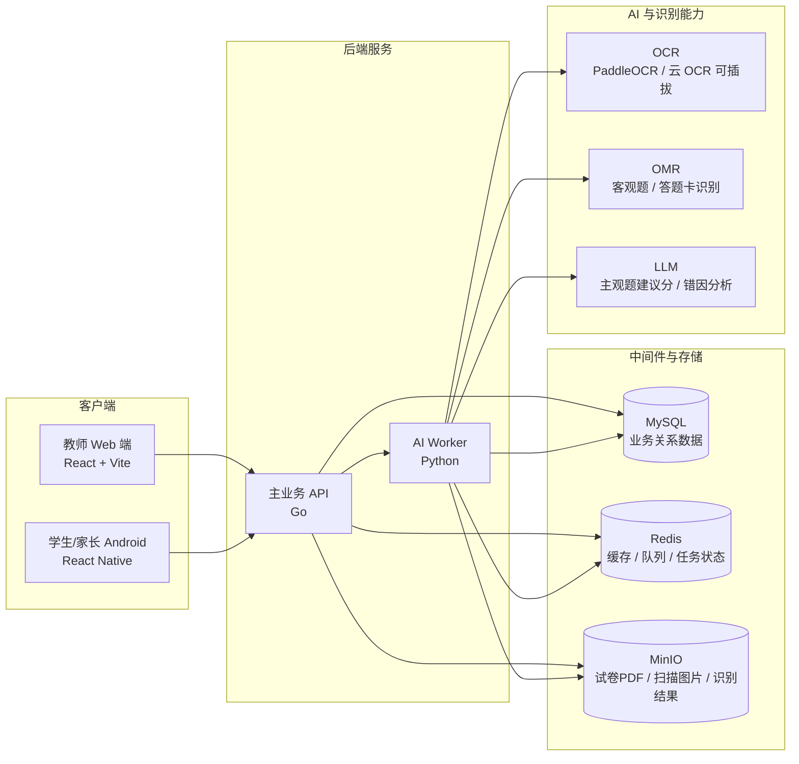

# Club - AI 阅卷与学情平台

Club 是一个面向学校、培训机构和教师的 AI 智能阅卷与学情分析系统。第一阶段聚焦可落地闭环：

```text
试卷模板 -> 扫描导入 -> OCR/OMR 阅卷 -> 教师复核 -> 成绩统计 -> 错题归档 -> 学情分析
```

## 工程结构

```text
club/
  apps/
    web/              # 教师 Web 端，现代轻量 SaaS 风
    mobile/           # React Native 移动端，Android 优先配置
  services/
    api/              # Go 主业务 API
    ai-worker/        # Python OCR/AI Worker 骨架
  packages/
    shared/           # 共享类型与接口说明
  docs/
    product.md        # 产品拆解
    prototype.md      # 原型说明
  infra/
    docker-compose.yml
```

## 技术架构

第一阶段采用“主业务 API + AI Worker + 基础中间件”的架构，先保证阅卷流程闭环稳定，再逐步增强 AI 能力。



### 后端边界

- `services/api`：Go 主业务服务，负责用户体系、学校/班级/学生、作业、试卷模板、阅卷流程、错题集、学情分析 API。
- `services/ai-worker`：Python AI 处理服务，负责 OCR、OMR、试卷拆解、题型识别、标准答案生成、主观题建议分、错因分析。
- Web 和移动端只调用 Go API，不直接调用 Python Worker。

### 中间件与数据库

- `MySQL`：主数据库。存学校、班级、教师、学生、作业、试卷模板、题目、答案、阅卷结果、错题、知识点、分析结果。
- `Redis`：缓存、任务队列、扫描/阅卷任务状态。第一阶段可直接用 Redis List/Stream，后续任务规模变大再替换 RabbitMQ/Kafka。
- `MinIO`：对象存储。存空白卷、学生扫描卷、PDF、题目区域截图、OCR 原始结果、批阅归档文件。
- `PaddleOCR`：优先作为私有化 OCR 方案；保留云 OCR 适配层，便于按学校部署条件切换。
- `LLM Provider`：可插拔，第一阶段只做建议分、理由、错因，不直接替代教师裁定。

### 开发调试配置

本地开发调试配置通过 `club/.env.local` 注入。该文件已加入 `.gitignore`，用于放置真实的 MySQL、Redis、OBS 等调试连接信息，不要提交到仓库。

安全模板放在 `club/.env.example`，新增同事或新环境可复制后填写：

```bash
cp .env.example .env.local
```

当前服务会在启动时从当前目录向上查找 `.env.local`：

- Go API：读取 `APP_ENV`、`PORT`、`MYSQL_*`、`REDIS_*`、`MINIO_*`、`OBS_*`。
- Python AI Worker：读取 `AI_WORKER_PORT`、`MYSQL_*`、`REDIS_*`、`OBS_*`。
- `/health` 只返回脱敏后的配置状态，例如地址、库名、是否提供密钥，不返回密码或 Secret。
- `GET /api/dev/connections` 用当前开发配置检查 MySQL、Redis、OBS/MinIO 连通性，仅返回连接状态和延迟，不返回密钥。

### 依赖镜像

Go 本地运行、调试、测试或安装依赖时统一带上：

```bash
GOPROXY=https://goproxy.cn,direct
```

示例：

```bash
GOPROXY=https://goproxy.cn,direct go test ./...
GOPROXY=https://goproxy.cn,direct go run ./cmd/server
```

Python 使用 pip 安装依赖前先配置豆瓣源：

```bash
pip config set global.index-url http://pypi.douban.com/simple/
pip config set global.trusted-host pypi.douban.com
```

### 核心数据流

```text
教师上传空白卷
-> Go API 保存模板任务
-> MinIO 存储原始文件
-> Redis 创建 AI 拆卷任务
-> Python Worker OCR/题区识别/题型识别
-> 教师确认题区、题型、分值、答案、知识点
-> 学生卷批量导入
-> OCR/OMR/AI 主观题建议分
-> 教师左右分屏复核
-> 成绩、错题、知识点掌握度入库
-> 学情分析输出
```

### 部署方向

- 本地开发：`docker-compose` 启动 MySQL、Redis、MinIO。
- 学校私有化：单机 Docker Compose 起步。
- 规模化部署：Kubernetes 拆分 Go API、Python Worker、OCR 服务、对象存储和数据库。

## 首版能力

- 教师工作台：扫描队列、待复核试卷、未提交作业、薄弱知识点。
- 主观题批阅：标准答案与学生试卷左右分屏对比，AI 给出建议分和理由，教师最终确认。
- 试卷模板：题目区域、题型、分值、知识点、标准答案。
- 学情分析：试卷分析、题目正确率、知识点掌握度、学生错题分布。
- 学生/家长端：任务查看、拍照上传、错题本。

## 本地启动

Go API:

```bash
cd services/api
GOPROXY=https://goproxy.cn,direct go run ./cmd/server
```

Python AI Worker:

```bash
cd services/ai-worker
python3 -m app.main
```

Web:

```bash
cd apps/web
npm install
npm run dev
```

Mobile Android:

```bash
cd apps/mobile
npm install
npm run android
```
