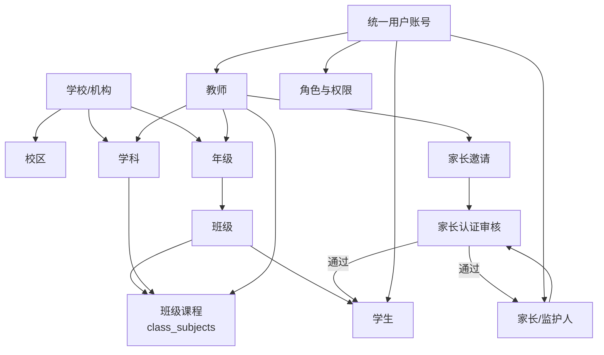

# 产品拆解

更新日期：2026-07-02

## 1. 产品定位

本产品是面向学校、培训机构和教师的 AI 阅卷与学情平台。第一阶段不做 AI 老师、AI 聊天陪练和完整学习规划，AI 作为能力层嵌入阅卷、识别、错因归档和学情分析流程，核心目标是降低教师在试卷制作、扫描导入、批阅复核、成绩统计、错题沉淀和家校反馈上的重复劳动。

第一阶段主闭环：

```text
组织与用户建档
-> 知识点/题库/模板准备
-> 作业或考试发布
-> 扫描/答题卡导入
-> OCR/OMR/AI 建议评分
-> 教师复核裁定
-> 成绩与错题入库
-> 班级学情、个人学情、家长反馈
-> 错题再练与后续组卷
```

AI 的定位是“建议与提效”，不是最终裁判。主观题最终分数、家长访问授权、组织关系维护均由教师或教务管理员确认。

## 2. 用户体系

### 2.1 角色

| 角色 | 主要目标 | 核心权限 | 当前产品能力 |
| --- | --- | --- | --- |
| 学校/机构管理员 | 建立组织结构、管理用户与数据资产 | 学校、年级、班级、学科、教师、学生、家长认证审核 | 组织关系图谱、组织实体创建、家长认证审核 |
| 任课教师 | 完成试卷模板、作业/考试阅卷、学情分析 | 模板制作、扫描导入、主观题复核、错题与学情查看、家长邀请 | 教师工作台、模板库、扫描任务、批阅工作台、学情分析、题库组卷 |
| 学生 | 查看任务、提交作业、查看成绩和错题 | 查看本人作业、成绩趋势、错题与薄弱点 | 学生门户、作业状态、成绩趋势、错题学科视图 |
| 家长/监护人 | 查看孩子完成情况和学习风险 | 通过认证后查看绑定学生的学情、作业、错题和 AI 能力预约 | 家长门户、孩子切换、邀请认证、学情反馈、AI 能力登记 |
| AI Worker/第三方 AI Provider | 提供识别、建议评分、错因和分析能力 | 读取任务、写回识别与 AI 结果 | OCR/OMR/主观题建议分、AI 任务队列、第三方 Provider 预留 |

### 2.2 用户与关系图谱



关键规则：

- 教师必须关联到学生所在年级，才可以创建家长邀请。
- 家长凭邀请 token 提交认证，管理员审核通过后才写入学生和家长的访问关系。
- 一个家长可以绑定多个学生，一个学生也可以绑定多个家长；主家长通过 `is_primary` 标识。
- 学生和家长门户只能展示本人或已认证孩子的数据，不能展示班级其他学生的个人明细。
- 教师与班级、学科、年级之间的关系决定后续作业、阅卷、分析和家校触达的可见范围。

## 3. 核心数据资产

| 数据资产 | 说明 | 来源 | 去向 |
| --- | --- | --- | --- |
| 组织图谱 | 学校、年级、班级、学科、教师、学生、家长关系 | 管理员/教师维护、家长认证 | 权限边界、门户访问、统计维度 |
| 试卷模板库 | 空白卷、题区坐标、题型、分值、标准答案、评分规则、知识点 | 教师创建、AI 拆卷建议 | 扫描任务、OCR/OMR 定位、阅卷复核 |
| 知识点图谱 | 年级、学科下的知识点及层级 | 管理员/教师维护、题库沉淀 | 题库、错题、学情掌握度 |
| 题库 | 题干、答案、解析、题型、难度、知识点 | 手工录入、错题沉淀、AI 预留 | 手工组卷、AI 组卷 |
| 扫描任务 | 学生扫描件、答题卡、处理状态、匹配关系 | Web 上传、移动端上传预留 | Worker 识别、教师复核 |
| 批阅结果 | 客观题得分、主观题建议分、教师最终分、批阅历史 | OMR/AI/教师裁定 | 成绩统计、错题归档 |
| 错题与错因 | 错题、知识点、错因、订正状态、再练状态 | 阅卷结果、教师修正、AI 建议 | 错题本、再练任务、个人学情 |
| 学情分析 | 班级分数、题目正确率、知识点掌握度、学生风险 | 批阅结果、错题、作业状态 | 教师看板、学生门户、家长报告 |
| AI 任务 | 组卷、拆卷、识别、批阅、深度分析、天梯计划等任务 | 业务动作创建 | Worker 或第三方 AI Provider |

## 4. 业务场景与流程

### 4.1 组织与身份建档

业务目标：先建立学校、年级、班级、学科、教师、学生与家长关系，保证后续阅卷数据可按组织维度归属，并为学生/家长门户提供访问边界。

流程：

1. 管理员创建学校、年级、学科。
2. 管理员创建班级，并绑定学校与年级。
3. 管理员或教务创建教师，绑定年级、学科，可选绑定授课班级。
4. 管理员或教师创建学生，绑定班级与学号。
5. 教师为学生创建家长邀请。
6. 家长提交 token、姓名、手机号、关系等认证信息。
7. 管理员审核认证，通过后写入学生与家长访问关系。
8. 家长登录家长门户后，只能查看已认证学生的学情。

闭环判断：组织数据可以支撑阅卷、门户和家校反馈的基础链路；但正式上线前还需要补齐登录鉴权、角色授权、数据范围校验和审计日志。

### 4.2 知识点与题库建设

业务目标：让错题、试卷模板和组卷有统一知识点锚点，后续学情分析可以从“分数”下钻到“知识点掌握度”。

流程：

1. 教师或管理员维护年级、学科下的知识点。
2. 教师录入题库题目，设置题型、难度、答案、解析。
3. 题目必须绑定至少一个知识点。
4. 题目可被手工组卷选用。
5. 错题也可重新绑定知识点，修正 AI 或模板带来的标签偏差。

闭环判断：题库与知识点已经形成“题目 -> 知识点 -> 错题 -> 学情”的基础闭环；后续需要补题目审核状态、题目版本、来源追溯和批量导入。

### 4.3 试卷模板制作

业务目标：教师将空白卷转为可被系统识别和批阅的结构化模板。

流程：

1. 教师创建草稿模板，填写试卷名称、年级、学科。
2. 教师上传空白卷。
3. 系统创建 AI 拆卷任务，返回题区、题型、分值、知识点和标准答案建议。
4. 教师在模板编辑器中框选或确认题目区域。
5. 教师补齐题号、题型、分值、标准答案、评分规则和知识点。
6. 草稿模板确认后发布。
7. 发布模板不可直接修改；如需调整，复制为新草稿版本。
8. 后续扫描任务绑定已发布模板和模板版本，避免历史扫描被新模板影响。

闭环判断：模板版本和发布状态已经考虑历史稳定性；需要继续补齐模板预览校验、模板有效性检查、题区冲突检查和发布前质量门禁。

### 4.4 扫描导入与学生匹配

业务目标：将线下纸质作答转为可识别、可匹配、可复核的线上任务。

流程：

1. 教师上传 PDF、图片、WebP 或 ZIP 扫描包。
2. 系统保存文件到本地或对象存储，记录对象文件元数据。
3. 教师创建扫描任务，填写标题、班级、页数、说明，并绑定已发布模板。
4. API 创建扫描任务并写入 Redis Stream。
5. AI Worker 消费任务，执行预处理、OCR、OMR、题区识别、主观题建议评分和错因建议。
6. Worker 写回任务状态、进度、模型版本和识别结果。
7. 教师在扫描预览中检查文件状态和学生匹配。
8. 对匹配失败或低置信度文件，教师手动绑定学生或发起重试。

闭环判断：任务创建、队列投递、进度写回、失败重试和手动匹配已经有接口支撑；需要补齐批量学生自动匹配策略、异常任务列表、文件级重试状态和 Worker 消费监控。

### 4.5 客观题阅卷

业务目标：客观题尽量自动化，但低置信度或空答案不能静默变成最终分。

流程：

1. Worker 输出 OMR 结果，包含题号、选项和置信度。
2. API 根据扫描任务绑定的模板版本查找题目标准答案和分值。
3. 系统写入客观题得分和题目分数。
4. 对空答案、低置信度或无法匹配题目的结果，创建客观题复核异常。
5. 教师处理异常后，分数才进入最终统计。

闭环判断：客观题“自动评分 + 异常复核”的安全闭环方向正确；需要补齐客观题异常处理界面、异常裁定记录和批量确认能力。

### 4.6 主观题批阅复核

业务目标：AI 给出建议分和理由，教师最终裁定，保留批阅历史。

流程：

1. Worker 根据学生答案 OCR、标准答案和评分规则生成建议分、理由、证据片段和置信度。
2. 系统生成主观题复核队列。
3. 教师进入左右分屏批阅界面。
4. 左侧展示标准答案、评分规则、知识点和满分。
5. 右侧展示学生作答、OCR 文本、AI 建议分和理由。
6. 教师可以接受 AI 建议、修改分数、驳回建议并填写备注。
7. 系统保存教师最终分、批阅动作、批阅阶段、模型版本和历史记录。
8. 当前题保存后进入下一题。

闭环判断：主观题从 AI 建议到教师裁定再到历史记录已经闭环；需要补齐多人复核、抽检、仲裁、越权批阅限制和分数范围校验。

### 4.7 成绩统计与班级学情

业务目标：教师阅卷完成后快速获得班级、题目、知识点和学生维度的分析。

流程：

1. 客观题和主观题分数进入题目分数表。
2. 系统按试卷、班级和学生汇总成绩。
3. 生成平均分、最高分、最低分、完成率、及格率、优秀率和分数段。
4. 生成题目正确率、得分率、难题识别、区分度和典型错误。
5. 生成知识点掌握度与薄弱排行。
6. 生成学生风险列表，如连续未提交、重点知识点薄弱等。
7. 教师查看班级画像，并决定是否创建错题再练。

闭环判断：分析结果已覆盖教师看板核心指标；需要明确统计口径、时间范围、考试维度筛选和重算机制。

### 4.8 错题归档与再练

业务目标：把阅卷结果转化为可持续使用的错题资产，而不是一次性成绩报表。

流程：

1. 系统从低分题、错误题和教师裁定结果生成错题。
2. 每道错题关联学生、题目、知识点、错因、原题、学生答案、正确答案和解析。
3. 教师可修正错题知识点。
4. 教师选择一批错题创建再练任务。
5. 再练任务记录关联错题、知识点、截止时间和状态。
6. 学生或家长门户展示个人错题、薄弱知识点和订正状态。

闭环判断：错题沉淀和再练任务已经形成学习反馈闭环；需要补齐再练提交、再批改、错题订正完成状态和错题复现率指标。

### 4.9 学生门户

业务目标：学生只看与自己相关的任务、成绩、趋势、错题和薄弱点。

流程：

1. 学生进入个人门户。
2. 系统读取学生所在年级和班级。
3. 展示最近成绩、作业完成情况、成绩趋势、学科错题、薄弱知识点。
4. 学生按学科查看错题来源和最近错题。
5. AI 学情分析和天梯提升计划暂作为登记意向，不生成虚假分析。

闭环判断：个人视图已经能承接阅卷结果；正式上线前必须接入登录态，禁止通过 URL 参数读取任意学生数据。

### 4.10 家长门户与家校反馈

业务目标：家长在认证后查看孩子学习风险、作业进度和错题重点，并为后续付费 AI 分析提供入口。

流程：

1. 教师为学生生成家长邀请。
2. 家长提交认证申请。
3. 管理员审核通过后，学生与家长建立访问关系。
4. 家长进入门户，系统列出已绑定孩子。
5. 家长切换孩子，查看该孩子成绩、作业、错题和薄弱点。
6. 家长可登记 AI 深度学情分析或天梯计划意向。

闭环判断：家长访问从邀请到审核再到门户查看已经闭环；需要补齐真实登录、手机号核验、认证材料、权限审计和付费状态。

### 4.11 题库组卷与 AI 能力预留

业务目标：把题库和错题资产继续反哺新的作业和练习。

流程：

1. 教师从题库筛选题目。
2. 教师创建试卷组合，设置题目顺序与分值。
3. 系统生成组卷记录。
4. 教师可触发 AI 组卷请求，创建 AI 任务。
5. 教师上传空白卷或学生答题卡，系统创建对应 AI 任务。
6. AI Provider 配置完成后，由调度接口派发任务并接受回调。

闭环判断：当前已经是“任务预留 + 人工组卷”阶段；AI 自动组卷、答题卡解析和标准答案批改仍需要 Provider 接入、结果回填和教师确认界面。

## 5. 核心业务状态机

### 5.1 模板状态

```text
draft -> published -> disabled
draft --复制/修改--> draft
published --复制新版本--> draft
```

规则：

- draft 可编辑。
- published 供扫描、考试和作业绑定。
- disabled 不再被新任务使用，但历史数据保留。

### 5.2 扫描任务状态

```text
创建 -> 排队中 -> 识别中 -> 识别完成 -> 待复核/已完成
                    -> 识别失败 -> 重试 -> 排队中
                    -> 队列投递失败 -> 重试
```

规则：

- 扫描任务必须保存文件列表。
- 答题卡扫描必须绑定已发布模板。
- 任务保存模板版本，历史处理不受模板后续修改影响。
- 文件级失败应允许单文件重试。

### 5.3 家长认证状态

```text
邀请 pending -> 认证 pending -> approved -> 建立 student_guardians
                         -> rejected -> 不建立访问关系
邀请 pending -> expired -> 不可认证
approved -> invitation used
```

规则：

- 认证通过前，家长不得访问学生数据。
- 审核后不允许重复处理同一认证。
- 一个邀请 token 只能在有效期内使用。

### 5.4 AI 任务状态

```text
pending -> config_required
pending -> processing -> succeeded
pending -> processing -> failed
processing -> callback 更新结果
```

规则：

- 没有 Provider 配置时，任务保留为待配置状态。
- 第三方 Provider 回调需要 callback secret。
- AI 结果进入业务前仍需对应业务的教师或管理员确认。

## 6. 逻辑闭环检查

| 闭环 | 当前状态 | 已闭合部分 | 需要补齐 |
| --- | --- | --- | --- |
| 组织与权限 | 半闭环 | 组织结构、角色表、教师/学生/家长关系、家长审核 | 登录鉴权、RBAC 校验、数据范围限制、审计 |
| 模板制作 | 基本闭环 | 草稿、发布、复制版本、题区、AI 建议 | 发布前校验、题区冲突、版本对比 |
| 扫描导入 | 基本闭环 | 文件上传、任务创建、队列投递、状态写回、重试 | 文件级异常 UI、自动学生匹配、监控告警 |
| 客观题阅卷 | 半闭环 | OMR 入库、低置信度异常 | 异常处理界面、裁定结果回写 |
| 主观题批阅 | 基本闭环 | AI 建议、教师最终分、历史记录 | 多轮复核、抽检、分数范围和权限校验 |
| 成绩分析 | 半闭环 | 班级分数、题目、知识点、学生风险 | 统计口径、考试筛选、重算任务 |
| 错题再练 | 半闭环 | 错题归档、知识点修正、再练任务创建 | 再练提交、再批改、订正完成闭环 |
| 学生门户 | 原型闭环 | 本人作业、成绩、错题、薄弱点 | 登录态、真实学生身份、移动端上传联动 |
| 家长门户 | 基本业务闭环 | 邀请、认证、审核、孩子切换、学情查看 | 手机号核验、认证材料、付费/开通状态 |
| AI 深度分析 | 预留 | AI 任务队列、Provider 派发、回调 | Provider 结果结构、结果审核、产品化展示 |

## 7. 当前阶段优先级

P0：

- 登录鉴权、角色权限和数据范围校验。
- 移除开发阶段硬编码用户 ID，门户接口必须从登录态推导用户。
- 完成客观题异常复核和再练提交闭环。
- 明确成绩统计口径和重算机制。

P1：

- 模板发布前校验、题区冲突检测、模板版本对比。
- 扫描任务文件级状态、自动学生匹配、异常队列。
- 家长认证材料、手机号核验和审核日志。
- AI Provider 结果结构标准化。

P2：

- AI 深度学情分析。
- 天梯提升计划。
- AI 自动组卷与个性化练习册。
- 多校区、多租户计费和运营后台。
