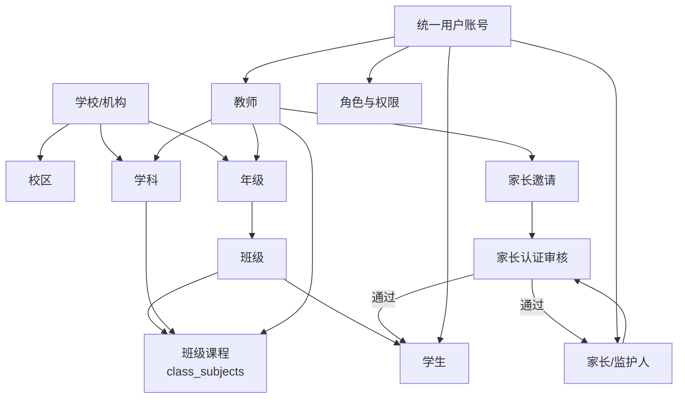

# 产品拆解

更新日期：2026-07-02

## 1. 产品定位

本产品是面向学校、培训机构和教师的 AI 阅卷与学情平台。第一阶段不做 AI 老师、AI 聊天陪练和完整学习规划，AI 作为能力层嵌入试卷导入、答题卡生成、识别阅卷、错因归档和学情分析流程，核心目标是降低教师在答题卡生成、扫描导入、批阅复核、成绩统计、错题沉淀和家校反馈上的重复劳动。

第一阶段主闭环：

```text
组织与用户建档
-> 知识点/题库准备
-> 试卷扫描导入
-> AI 生成答题卡
-> 考试发布/组织考试
-> 考后答题卡扫描导入
-> OCR/OMR/AI 建议评分
-> 全自动阅卷或教师介入式阅卷
-> 成绩与错题入库
-> 班级学情、个人学情、家长反馈
-> 错题再练与后续组卷
```

AI 的定位是“建议与提效”。客观题在规则明确且置信度达标时可以全自动判分；主观题和异常答题卡默认进入介入式阅卷，只有满足风险阈值、评分规则明确、置信度达标、抽检策略允许的低风险结果才可自动通过。家长访问授权、组织关系维护、异常答题卡处理和争议分数裁定均由教师或教务管理员确认。

## 1.1 本次复核结论

本次复核后，产品主线统一为“试卷导入生成答题卡”，不再把第一阶段核心场景描述为“教师手工制作试卷模板”。仍需闭环的关键点如下：

- 答题卡版本必须成为考试、扫描、识别和成绩统计的绑定对象，避免后续修改影响历史考试。
- 全自动阅卷需要明确可自动通过的风险阈值，包括题型、置信度、分值占比、抽检比例和异常回退规则。
- 介入式阅卷需要覆盖客观题异常、主观题建议分、低置信度识别、学生匹配失败和争议仲裁。
- 学情分析必须以“已确认的最终分”为输入，不能把待复核、低置信度或未确认结果直接计入正式报告。
- 学生/家长端只展示已发布且已确认的数据，待复核结果最多展示为“处理中”，避免提前暴露不稳定成绩。

## 2. 用户体系

### 2.1 角色

| 角色 | 主要目标 | 核心权限 | 当前产品能力 |
| --- | --- | --- | --- |
| 学校/机构管理员 | 建立组织结构、管理用户与数据资产 | 学校、年级、班级、学科、教师、学生、家长认证审核 | 组织关系图谱、组织实体创建、家长认证审核 |
| 任课教师 | 完成试卷导入、答题卡确认、作业/考试阅卷、学情分析 | 试卷导入、答题卡确认、扫描导入、自动阅卷配置、介入式复核、错题与学情查看、家长邀请 | 教师工作台、答题卡生成、扫描任务、批阅工作台、学情分析、题库组卷 |
| 学生 | 查看任务、提交作业、查看成绩和错题 | 查看本人作业、成绩趋势、错题与薄弱点 | 学生门户、作业状态、成绩趋势、错题学科视图 |
| 家长/监护人 | 查看孩子完成情况和学习风险 | 通过认证后查看绑定学生的学情、作业、错题和 AI 能力预约 | 家长门户、孩子切换、邀请认证、学情反馈、AI 能力登记 |
| AI Worker/第三方 AI Provider | 提供识别、建议评分、错因和分析能力 | 读取任务、写回识别与 AI 结果 | OCR/OMR/主观题建议分、AI 任务队列、第三方 Provider 预留 |

### 2.2 用户与关系图谱


```mermaid
flowchart TD
  School["学校/机构"]
  Campus["校区"]
  Grade["年级"]
  Class["班级"]
  Subject["学科"]
  Course["班级课程\nclass_subjects"]
  Teacher["教师"]
  Student["学生"]
  Guardian["家长/监护人"]
  User["统一用户账号"]
  Role["角色与权限"]
  Invitation["家长邀请"]
  Certification["家长认证审核"]

  School --> Campus
  School --> Grade
  Grade --> Class
  School --> Subject
  Class --> Course
  Subject --> Course
  Teacher --> Course
  Teacher --> Grade
  Teacher --> Subject
  Class --> Student
  Guardian --> Certification
  Teacher --> Invitation
  Invitation --> Certification
  Certification -->|通过| Guardian
  Certification -->|通过| Student
  User --> Role
  User --> Teacher
  User --> Student
  User --> Guardian
```

关键规则：

- 教师必须关联到学生所在年级，才可以创建家长邀请。
- 家长凭邀请 token 提交认证，管理员审核通过后才写入学生和家长的访问关系。
- 一个家长可以绑定多个学生，一个学生也可以绑定多个家长；主家长通过 `is_primary` 标识。
- 学生和家长门户只能展示本人或已认证孩子的数据，不能展示班级其他学生的个人明细。
- 教师与班级、学科、年级之间的关系决定后续作业、阅卷、分析和家校触达的可见范围。

## 3. 核心数据资产

| 数据资产 | 说明 | 来源 | 去向 |
| --- | --- | --- | --- |
| 组织图谱 | 学校、年级、班级、学科、教师、学生、家长关系 | 管理员/教师维护、家长认证 | 权限边界、门户访问、统计维度 |
| 答题卡/考试配置库 | 原始试卷、AI 生成答题卡、题区坐标、题型、分值、标准答案、评分规则、知识点、阅卷策略、版本 | 试卷扫描导入、AI 生成、教师确认 | 考试发布、答题卡扫描、OCR/OMR 定位、自动/介入式阅卷 |
| 知识点图谱 | 年级、学科下的知识点及层级 | 管理员/教师维护、题库沉淀 | 题库、错题、学情掌握度 |
| 题库 | 题干、答案、解析、题型、难度、知识点 | 手工录入、错题沉淀、AI 预留 | 手工组卷、AI 组卷 |
| 扫描任务 | 学生答题卡扫描件、处理状态、匹配关系、异常信息 | Web 上传、移动端上传预留 | Worker 识别、教师复核 |
| 批阅结果 | 客观题得分、主观题建议分、教师最终分、批阅历史 | OMR/AI/教师裁定 | 成绩统计、错题归档 |
| 阅卷策略 | 自动通过阈值、异常规则、抽检比例、人工复核范围 | 教师/教务配置、系统默认策略 | 自动阅卷决策、介入式阅卷队列、质量审计 |
| 错题与错因 | 错题、知识点、错因、订正状态、再练状态 | 阅卷结果、教师修正、AI 建议 | 错题本、再练任务、个人学情 |
| 学情分析 | 班级分数、题目正确率、知识点掌握度、学生风险 | 批阅结果、错题、作业状态 | 教师看板、学生门户、家长报告 |
| AI 任务 | 组卷、答题卡生成、识别、批阅、深度分析、天梯计划等任务 | 业务动作创建 | Worker 或第三方 AI Provider |

## 4. 业务场景与流程

### 4.1 组织与身份建档

业务目标：先建立学校、年级、班级、学科、教师、学生与家长关系，保证后续阅卷数据可按组织维度归属，并为学生/家长门户提供访问边界。

流程：

1. 管理员创建学校、年级、学科。
2. 管理员创建班级，并绑定学校与年级。
3. 管理员或教务创建教师，绑定年级、学科，可选绑定授课班级。
4. 管理员或教师创建学生，绑定班级与学号。
5. 教师为学生创建家长邀请。
6. 家长提交 token、姓名、手机号、关系等认证信息。
7. 管理员审核认证，通过后写入学生与家长访问关系。
8. 家长登录家长门户后，只能查看已认证学生的学情。

闭环判断：组织数据可以支撑阅卷、门户和家校反馈的基础链路；但正式上线前还需要补齐登录鉴权、角色授权、数据范围校验和审计日志。

### 4.2 知识点与题库建设

业务目标：让错题、答题卡和组卷有统一知识点锚点，后续学情分析可以从“分数”下钻到“知识点掌握度”。

流程：

1. 教师或管理员维护年级、学科下的知识点。
2. 教师录入题库题目，设置题型、难度、答案、解析。
3. 题目必须绑定至少一个知识点。
4. 题目可被手工组卷选用。
5. 错题也可重新绑定知识点，修正 AI 或答题卡识别带来的标签偏差。

闭环判断：题库与知识点已经形成“题目 -> 知识点 -> 错题 -> 学情”的基础闭环；后续需要补题目审核状态、题目版本、来源追溯和批量导入。

### 4.3 试卷答题卡生成

业务目标：教师可以通过 AI 自动分析试卷生成答题卡模板，也可以在答题卡配置页人工生成答题卡。答题卡用于考试填涂、主观题作答、考后扫描识别和自动阅卷，是围绕“试卷导入 -> 答题卡生成 -> 答题卡回收识别 -> 自动阅卷 -> 学情分析”的考试闭环生成。

流程：

1. 教师选择答题卡生成方式：AI 自动生成或人工配置生成。
2. AI 自动生成时，教师上传原始试卷，系统保存试卷文件并创建试卷解析任务。
3. AI 只识别答题卡生成所需的结构信息：题号、题号层级、题型和题量；题号需要支持大题和小题，例如“一、1、2、3”或“一、（1）（2）”。AI 不在该阶段直接判定学生答案。
4. 系统根据题型选择不同答题卡组件和版式策略，生成答题卡草稿。
5. 人工配置生成时，教师进入答题卡配置页，选择学科、整体分值、考试时长、班级、姓名、考号等基础信息，并按大题配置题号、题型、数量和分值。
6. 教师在预览页确认或调整答题卡结构、题型、分值、版面区域、页数和打印效果。
7. 确认后发布为本次考试使用的答题卡版本，并进入考试发布与答题卡分发流程。
8. 考试结束后，教师批量扫描导入学生答题卡，系统执行学生匹配、答题区域定位、OCR/OMR 识别和异常检测。
9. 系统进入自动阅卷环节：客观题可全自动判分；主观题由 AI 给出建议分、理由和证据，教师可选择全自动通过低风险结果，也可进入介入式阅卷进行人工复核、改分和仲裁。
10. 阅卷完成后保存客观题得分、主观题最终分、批阅历史、错题、错因和知识点结果。
11. 系统基于保存结果生成班级成绩统计、题目正确率、知识点掌握度、学生错题本和家长/学生端学情反馈。

答题卡必备参数：

| 参数 | 说明 | 规则 |
| --- | --- | --- |
| 学科 | 语文、数学、英语等 | 必填，用于题型默认模板、知识点和报告维度 |
| 班级 | 本次考试适用班级 | 必填，支持多班级或后续考试发布时绑定 |
| 姓名 | 学生姓名填写区 | 必填，答题卡头部固定字段 |
| 考号 | 学生考号或学号填写/填涂区 | 必填，优先用于自动学生匹配 |
| 整体分值 | 本张试卷满分 | 必填，应等于各题分值合计 |
| 考试时长 | 如 90 分钟、120 分钟 | 必填，用于答题卡头部展示和考试配置 |

AI 自动生成规则：

- AI 输入是原始试卷文件，输出是答题卡结构草稿。
- AI 识别边界限定为题号、题号层级、题型和题量，不要求在该阶段生成答案、解析或评分理由。
- 题号识别要区分大题和小题，大题用于分组和换行，小题用于答题区域编号。
- 题型至少覆盖选择题、填空题、判断题、计算题、问答题、作文；无法确认题型时标记为“待确认”，进入人工调整。
- AI 生成结果必须进入教师确认页，不能直接发布。

人工配置页需求：

| 配置项 | 示例 | 说明 |
| --- | --- | --- |
| 学科 | 数学 | 控制题型默认组件和答题区域风格 |
| 整体分值 | 100 分 | 与题目分值合计做一致性校验 |
| 考试时长 | 90 分钟 | 展示在答题卡头部 |
| 班级字段 | 六年级 3 班 | 可固定展示或留空填写 |
| 姓名字段 | 姓名：____ | 必须出现在答题卡头部 |
| 考号字段 | 考号填涂/书写区 | 支持手写格或填涂区 |
| 大题配置 | 题号：一；题型：选择题；数量：10；分值：1 分 | 一行配置生成一个大题组 |
| 小题配置 | 1-10 | 根据数量自动生成，也允许手动调整 |

题型版式规则：

| 题型 | 答题卡版式要求 |
| --- | --- |
| 选择题 | 使用规则填涂区，选项横向或矩阵排列，题号清晰，选项间距稳定，适配 OMR 识别 |
| 判断题 | 使用“对/错”或“T/F”填涂区，和选择题视觉区分，避免学生混填 |
| 填空题 | 每题提供足够横向书写空间，支持多空题拆分为多个横线或答案框 |
| 计算题 | 使用较大的过程书写区域，保留步骤空间，题与题之间有明确边界 |
| 问答题 | 使用多行书写区域，行距清晰，支持按分值自动扩展空间 |
| 作文 | 使用作文格或大面积书写区域，支持字数提示、页码延续和跨页区域 |

版式与可用性要求：

- 大题之间必须换行或分区，保持明确行间距和分组标题。
- 同一大题内的小题编号要连续、清晰、易扫描定位。
- 不同题型使用不同答题组件，不能简单堆叠同一种空白框。
- 填空题横向空间要优先保证学生书写，不足时自动换行。
- 主观题按分值和题型预估书写面积，分值越高默认空间越大。
- 需要支持 A4 打印预览、分页预览和页码标识。
- 答题区域不能压到页边距、二维码/定位点、姓名和考号区域。
- 发布前必须校验总分是否等于各题分值合计、题号是否重复、题区是否重叠、必备参数是否完整。

闭环判断：该流程从试卷导入到答题卡生成、答题卡回收、自动/介入式阅卷、结果保存和学情分析形成考试业务闭环；后续需要补齐答题卡版式预览、AI 生成结果校验、答题卡版本锁定、异常答题卡人工处理和全自动阅卷风险阈值配置。

### 4.4 考试发布与答题卡分发

业务目标：在答题卡确认后，将答题卡版本、考试信息、班级名单和阅卷策略绑定成一次可追溯的考试任务，保证考后扫描、阅卷和学情分析有明确归属。

流程：

1. 教师选择已发布答题卡版本，创建考试或作业任务。
2. 教师选择考试班级、学生名单、考试时间、科目、满分和阅卷策略。
3. 系统生成本场考试的答题卡打印/导出文件，并记录答题卡版本号。
4. 考试开始后，系统锁定本场考试的答题卡版本、学生名单和题目分值，后续修改只能复制新版本或创建补录说明。
5. 考试结束后，教师按本场考试回收答题卡并创建考后扫描任务。
6. 未参加、缺考、补考、缺页和替换答题卡需要作为独立异常状态记录，避免影响班级统计口径。

闭环判断：考试发布把“答题卡生成”和“考后扫描导入”连接起来，补齐了考试归属、名单锁定和统计口径；后续需要补齐答题卡打印导出、缺考/补考处理、考试锁定策略和班级名单变更审计。

### 4.5 扫描导入与学生匹配

业务目标：将考后纸质答题卡转为可识别、可匹配、可复核的线上任务，并确保扫描任务绑定的是本场考试确认后的答题卡版本。

流程：

1. 教师上传考后答题卡 PDF、图片、WebP 或 ZIP 扫描包。
2. 系统保存文件到本地或对象存储，记录对象文件元数据。
3. 教师创建扫描任务，填写标题、班级、页数、说明，并绑定已发布的答题卡版本和考试/班级。
4. API 创建扫描任务并写入 Redis Stream。
5. AI Worker 消费任务，执行预处理、学生信息识别、OCR、OMR、答题区域定位、主观题建议评分和错因建议。
6. Worker 写回任务状态、进度、模型版本和识别结果。
7. 教师在扫描预览中检查文件状态、页码完整性、学生匹配和异常答题卡。
8. 对匹配失败、页码缺失、低置信度或答题区域异常的文件，教师手动绑定学生、标记异常、发起重试或进入介入式阅卷。

闭环判断：任务创建、队列投递、进度写回、失败重试和手动匹配已经有接口支撑；需要补齐答题卡版本绑定、批量学生自动匹配策略、异常任务列表、文件级重试状态、缺页检测和 Worker 消费监控。

### 4.6 客观题阅卷

业务目标：客观题尽量自动化，但低置信度或空答案不能静默变成最终分。

流程：

1. Worker 输出 OMR 结果，包含题号、选项、填涂状态、置信度和答题区域定位。
2. API 根据扫描任务绑定的答题卡版本查找题目标准答案、分值和自动通过阈值。
3. 对题号匹配、答案有效、置信度达标的客观题，系统写入自动评分结果。
4. 对空答案、低置信度、多选异常、题区无法定位或无法匹配题目的结果，创建客观题复核异常。
5. 教师处理异常后，异常题分数才进入最终统计；未处理异常只能进入临时结果，不进入正式成绩。

闭环判断：客观题“自动评分 + 异常复核”的安全闭环方向正确；需要补齐客观题异常处理界面、异常裁定记录、批量确认能力和正式成绩入库门禁。

### 4.7 主观题批阅复核

业务目标：AI 给出建议分和理由，系统按风险阈值决定是否自动通过；需要介入的主观题由教师最终裁定，并保留批阅历史。

流程：

1. Worker 根据学生答案 OCR、标准答案和评分规则生成建议分、理由、证据片段和置信度。
2. 系统根据题型、分值、置信度、AI 理由完整度、历史抽检策略和教师配置判断是否允许自动通过。
3. 达到自动通过条件的主观题进入“自动通过待抽检”状态；未达到条件的主观题进入介入式阅卷队列。
4. 教师进入左右分屏批阅界面：左侧展示标准答案、评分规则、知识点和满分；右侧展示学生作答、OCR 文本、AI 建议分和理由。
5. 教师可以接受 AI 建议、修改分数、驳回建议、发起二评或仲裁，并填写备注。
6. 系统保存最终分、批阅动作、批阅阶段、模型版本、自动通过原因或人工修改原因。
7. 当前题保存后进入下一题；抽检不通过的自动通过题应回退为介入式复核。

闭环判断：主观题从 AI 建议、自动通过判断、教师裁定到历史记录已经形成业务闭环；需要补齐多人复核、抽检回退、仲裁、越权批阅限制、分数范围校验和自动通过阈值管理。

### 4.8 成绩统计与班级学情

业务目标：教师阅卷完成后快速获得班级、题目、知识点和学生维度的分析。

流程：

1. 只有客观题确认分、主观题最终分、自动通过且未被抽检驳回的分数进入题目分数表。
2. 系统按考试、答题卡版本、班级和学生汇总成绩。
3. 生成平均分、最高分、最低分、完成率、及格率、优秀率和分数段。
4. 生成题目正确率、得分率、难题识别、区分度和典型错误。
5. 生成知识点掌握度与薄弱排行。
6. 生成学生风险列表，如连续未提交、重点知识点薄弱等。
7. 教师查看班级画像，并决定是否创建错题再练。

闭环判断：分析结果已覆盖教师看板核心指标；需要明确统计口径、时间范围、考试/答题卡版本筛选、异常未处理时的报告状态和重算机制。

### 4.9 错题归档与再练

业务目标：把阅卷结果转化为可持续使用的错题资产，而不是一次性成绩报表。

流程：

1. 系统从低分题、错误题和教师裁定结果生成错题。
2. 每道错题关联学生、题目、知识点、错因、原题、学生答案、正确答案和解析。
3. 教师可修正错题知识点。
4. 教师选择一批错题创建再练任务。
5. 再练任务记录关联错题、知识点、截止时间和状态。
6. 学生或家长门户展示个人错题、薄弱知识点和订正状态。

闭环判断：错题沉淀和再练任务已经形成学习反馈闭环；需要补齐再练提交、再批改、错题订正完成状态和错题复现率指标。

### 4.10 学生门户

业务目标：学生只看与自己相关的任务、成绩、趋势、错题和薄弱点。

流程：

1. 学生进入个人门户。
2. 系统读取学生所在年级和班级。
3. 展示最近成绩、作业完成情况、成绩趋势、学科错题、薄弱知识点。
4. 学生按学科查看错题来源和最近错题。
5. AI 学情分析和天梯提升计划暂作为登记意向，不生成虚假分析。

闭环判断：个人视图已经能承接阅卷结果；正式上线前必须接入登录态，禁止通过 URL 参数读取任意学生数据。

### 4.11 家长门户与家校反馈

业务目标：家长在认证后查看孩子学习风险、作业进度和错题重点，并为后续付费 AI 分析提供入口。

流程：

1. 教师为学生生成家长邀请。
2. 家长提交认证申请。
3. 管理员审核通过后，学生与家长建立访问关系。
4. 家长进入门户，系统列出已绑定孩子。
5. 家长切换孩子，查看该孩子成绩、作业、错题和薄弱点。
6. 家长可登记 AI 深度学情分析或天梯计划意向。

闭环判断：家长访问从邀请到审核再到门户查看已经闭环；需要补齐真实登录、手机号核验、认证材料、权限审计和付费状态。

### 4.12 题库组卷与 AI 能力预留

业务目标：把题库和错题资产继续反哺新的作业和练习。

流程：

1. 教师从题库筛选题目。
2. 教师创建试卷组合，设置题目顺序与分值。
3. 系统生成组卷记录。
4. 教师可触发 AI 组卷请求，创建 AI 任务。
5. 组卷完成后可进入“试卷导出/扫描导入 -> AI 生成答题卡”的流程，或直接基于结构化试卷生成答题卡草稿。
6. 教师上传学生答题卡后，系统创建识别和阅卷任务。
7. AI Provider 配置完成后，由调度接口派发任务并接受回调。

闭环判断：当前已经是“任务预留 + 人工组卷”阶段；AI 自动组卷、结构化试卷生成答题卡、答题卡解析和标准答案批改仍需要 Provider 接入、结果回填和教师确认界面。

## 5. 核心业务状态机

### 5.1 答题卡版本状态

```text
draft -> confirmed -> published -> locked -> archived
draft --AI 重新生成/教师调整--> draft
published --复制新版本--> draft
```

规则：

- draft 是 AI 生成或教师调整中的答题卡草稿，可编辑。
- confirmed 是教师确认题号、题型、分值、答案、区域和阅卷策略后的版本。
- published 供考试发布、打印和考后扫描任务绑定。
- locked 表示已有答题卡扫描或阅卷结果写入，不能直接修改，只能复制新版本。
- archived 不再被新考试使用，但历史考试、扫描和学情分析必须可追溯。

### 5.2 考试状态

```text
draft -> published -> in_progress -> ended -> scanning -> grading -> score_confirmed -> reported
                         -> cancelled
```

规则：

- draft 可调整考试名称、班级、学生名单、答题卡版本和阅卷策略。
- published 后答题卡版本和题目分值应锁定。
- in_progress 到 ended 之间只记录考试执行状态，不允许替换答题卡版本。
- scanning 和 grading 期间可以处理缺考、补考、缺页、学生匹配和阅卷异常。
- score_confirmed 后成绩成为学情分析、学生端和家长端的正式数据来源。
- reported 后如需修正分数，必须产生重算记录和报告修订记录。

### 5.3 扫描任务状态

```text
创建 -> 排队中 -> 识别中 -> 识别完成 -> 待异常处理 -> 待阅卷 -> 阅卷中 -> 成绩已确认
                    -> 识别失败 -> 重试 -> 排队中
                    -> 队列投递失败 -> 重试
```

规则：

- 扫描任务必须保存文件列表。
- 答题卡扫描必须绑定已发布答题卡版本。
- 任务保存答题卡版本，历史处理不受答题卡后续修改影响。
- 文件级失败应允许单文件重试。
- 存在未处理异常时，任务不能进入正式成绩确认。

### 5.4 阅卷结果状态

```text
待识别 -> 已识别 -> 自动评分候选 -> 自动通过待抽检 -> 最终确认
                    -> 需人工复核 -> 已人工确认 -> 最终确认
                    -> 二评/仲裁 -> 已仲裁 -> 最终确认
```

规则：

- 客观题低置信度、多选异常、空答案和题区异常必须进入人工复核。
- 主观题只有达到自动通过阈值并满足抽检策略时，才能从自动评分候选进入自动通过待抽检。
- 学情分析只读取最终确认结果；待复核、待抽检、仲裁中结果不能进入正式报告。

### 5.5 家长认证状态

```text
邀请 pending -> 认证 pending -> approved -> 建立 student_guardians
                         -> rejected -> 不建立访问关系
邀请 pending -> expired -> 不可认证
approved -> invitation used
```

规则：

- 认证通过前，家长不得访问学生数据。
- 审核后不允许重复处理同一认证。
- 一个邀请 token 只能在有效期内使用。

### 5.6 AI 任务状态

```text
pending -> config_required
pending -> processing -> succeeded
pending -> processing -> failed
processing -> callback 更新结果
```

规则：

- 没有 Provider 配置时，任务保留为待配置状态。
- 第三方 Provider 回调需要 callback secret。
- AI 结果进入业务前仍需对应业务的教师或管理员确认。

## 6. 逻辑闭环检查

| 闭环 | 当前状态 | 已闭合部分 | 需要补齐 |
| --- | --- | --- | --- |
| 组织与权限 | 半闭环 | 组织结构、角色表、教师/学生/家长关系、家长审核 | 登录鉴权、RBAC 校验、数据范围限制、审计 |
| 试卷答题卡生成 | 半闭环 | 试卷上传、AI 任务预留、答题卡结构确认方向 | 答题卡版式预览、AI 生成质量校验、版本锁定、打印/导出 |
| 考试发布与分发 | 半闭环 | 可围绕班级和答题卡创建任务 | 考试状态机、名单锁定、缺考/补考、答题卡打印导出、变更审计 |
| 考后答题卡扫描导入 | 半闭环 | 文件上传、任务创建、队列投递、状态写回、重试 | 答题卡版本绑定、缺页检测、文件级异常 UI、自动学生匹配、监控告警 |
| 客观题阅卷 | 半闭环 | OMR 入库、低置信度异常 | 异常处理界面、裁定结果回写、正式成绩入库门禁 |
| 主观题批阅 | 半闭环 | AI 建议、教师最终分、历史记录 | 自动通过阈值、抽检回退、多轮复核、仲裁、分数范围和权限校验 |
| 成绩分析 | 半闭环 | 班级分数、题目、知识点、学生风险 | 统计口径、考试/答题卡版本筛选、异常未处理状态、重算任务 |
| 错题再练 | 半闭环 | 错题归档、知识点修正、再练任务创建 | 再练提交、再批改、订正完成闭环 |
| 学生门户 | 原型闭环 | 本人作业、成绩、错题、薄弱点 | 登录态、真实学生身份、仅展示已确认成绩、移动端上传联动 |
| 家长门户 | 基本业务闭环 | 邀请、认证、审核、孩子切换、学情查看 | 手机号核验、认证材料、权限审计、仅展示已确认成绩、付费/开通状态 |
| AI 深度分析 | 预留 | AI 任务队列、Provider 派发、回调 | Provider 结果结构、结果审核、产品化展示 |

## 7. 当前阶段优先级

P0：

- 登录鉴权、角色权限和数据范围校验。
- 移除开发阶段硬编码用户 ID，门户接口必须从登录态推导用户。
- 完成答题卡版本锁定、客观题异常复核和再练提交闭环。
- 完成考试发布、名单锁定、缺考/补考和答题卡分发闭环。
- 明确全自动阅卷阈值、抽检比例和异常回退规则。
- 明确成绩统计口径和重算机制。

P1：

- 答题卡发布前校验、题区冲突检测、版本对比和打印/导出。
- 扫描任务文件级状态、自动学生匹配、缺页检测、异常队列。
- 家长认证材料、手机号核验和审核日志。
- AI Provider 结果结构标准化。

P2：

- AI 深度学情分析。
- 天梯提升计划。
- AI 自动组卷与个性化练习册。
- 多校区、多租户计费和运营后台。
